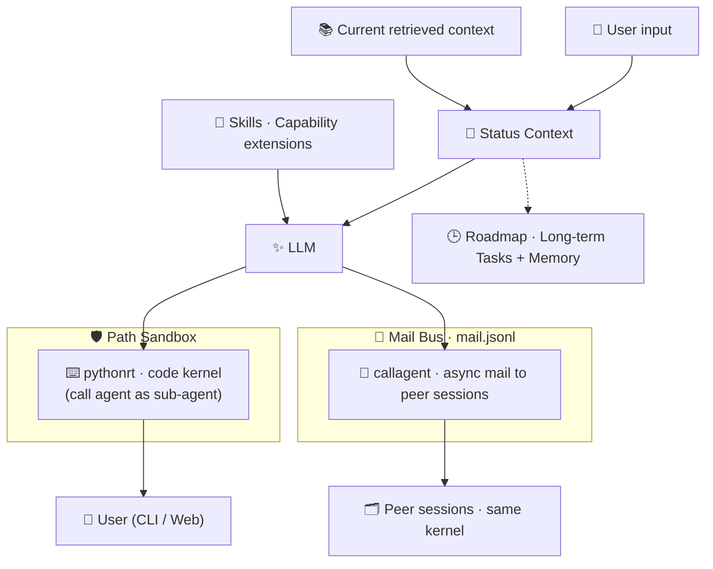
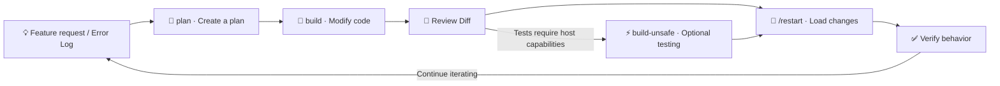

[简体中文](README.zh-CN.md) | English | [📕 图文介绍](rednote.md)

<h1 align="center">XKAgent · eXtensible Kernel Agent</h1>

<p align="center">
  <strong>A pure-Python, skill-extensible, status-aware agent runtime prioritizing code over tools.</strong>
</p>

<p align="center">
  
  
  
  
</p>

<p align="center">
  <a href="#quick-start">Quick Start</a> ·
  <a href="#customize-xkagent">Customize XKAgent</a> ·
  <a href="#docs">Documentation</a>
</p>

<p align="center">
  
</p>

---

XKAgent is a lightweight, locally run agent runtime designed for continuous extension. Instead of adding a dedicated Tool for every capability, it lets the model compose Python code through `pythonrt`, with Skills and Status providing extensibility and context.

## 📜 Changelog

- **0.2.0 — 2026-09-11**: multi-agent communication (`callagent`), msgz session storage, Status Info, web UI improvements, and expanded skills — see [release notes](docs/release_notes_0.2.0.md).
- **0.1.0 — 2026-08-14**: first public release — `pythonrt` code kernel with path sandbox, pluggable skills, and CLI and Web on one kernel.

## ✨ Why XKAgent

XKAgent aims to make an agent kernel that is **easy to understand, modify, and extend over time**. Rather than accumulating specialized tools, it provides clear interfaces for execution, extension, and state.

### 🐍 Pure Python · Lightweight, transparent, and self-hosting

The core is written entirely in Python. The CLI and LLM integration require only `requests`, while the `pythonrt` sandbox itself uses the standard library. Web access, semantic search, and Git inside the sandbox are optional. A small dependency surface makes the runtime easier to read, debug, and replace—and allows XKAgent to help modify its own code.

### ⌨️ pythonrt · Code over Tools, Agent as a Function

Instead of defining separate Tools for reading files, transforming data, or calling libraries, XKAgent lets the model write and compose Python code through `pythonrt`. Code is the general-purpose tool: one execution primitive can perform multi-step operations, reuse existing libraries, and verify results, reducing both tool count and round trips.

`pythonrt` can also call `agent` from within a task chain, delegating steps that need independent semantic reasoning to a sub-agent. Once a structured result is returned, the main flow continues. A sub-agent is therefore not a parallel tool system, but a composable, nestable capability within the code-first execution kernel.

### 🧩 Skills · Extend capabilities outside the kernel

A Skill organizes domain knowledge, workflows, references, and scripts in a self-contained directory. Skills can be added or overridden without changing the Agent main loop, and can be hot-loaded at runtime. The core stays small and stable while task-specific capabilities continue to grow.

### 🧭 Status · A state foundation for long-running tasks and Memory

An Agent should see more than the user's latest message. On every request, XKAgent injects the current time, runtime mode, path permissions, suggested skills, and retrieved information, so the model knows its current state, available actions, and relevant long-term memories, project documentation, or external knowledge. Beyond the read-only system fields, a session can maintain a writable **Status Info** board via `addinfo` / `listinfo` / `rminfo` (or the `/addinfo` commands)—short, durable, injected every turn, and preserved across compaction. Status injection is implemented. Full long-running task orchestration and long-term Memory are not yet implemented; both are planned on top of this stable state interface.

### 📮 Multi-Agent Communication · Asynchronous collaboration across sessions

Sessions can collaborate by mail: `callagent` writes an asynchronous message into the global `mail.jsonl` bus, and the per-round carrier delivers it to any session—supporting delayed/absolute wake-ups, priority, reply chains, broadcasts, and per-recipient provider overrides. Scheduled wake-ups, information exchange, and long-task hosting are all built on this primitive. See [11 · Multi-Agent Communication](.xkagent/docs/11-multi-agent-communication.md).

### 🛡️ Sandbox · Progressive trust, not absolute security

XKAgent opens execution permissions progressively through three modes:

| Mode | Purpose | Permissions |
|---|---|---|
| 🔎 `plan` | Read code, analyze requirements, and create plans | Project paths are read-only; `/tmp` is writable |
| 🔧 `build` | Modify code and documentation | Only authorized paths are writable; lightweight sandbox restrictions still apply |
| ⚡ `build-unsafe` | Run tests or tasks requiring full Python | Close to host Python, with only limited safeguards |

The path sandbox reduces the risk of accidental LLM actions; it is not designed to defend against malicious code or other high-risk scenarios. To undo ordinary changes, you can ask the Agent to reverse them using the current session's edit history, backup files, and diff. This is not a transactional automatic rollback mechanism. Users should still protect important data with Git, snapshots, or other backups.

---

## ⚙️ How It Works



Each interaction follows the path “user interaction → context injection → model planning → composed Python execution → response to the user,” rather than having the model click through tools one by one. The dashed `Roadmap` edge only indicates that Status can support long-running tasks and long-term Memory in the future; it does not mean either capability is already implemented. See the [Architecture Overview](.xkagent/docs/architecture-overview.md) for details.

---

<a id="quick-start"></a>

## 🚀 Quick Start

### ① Download

```bash
git clone <your-repository-url> xkagent
cd xkagent
```

You can also download the source directly and enter the project directory.

### ② Install

For CLI-only use, install the minimal dependency:

```bash
python -m pip install requests
```

To use optional features such as Web, semantic search, and built-in Git, install all dependencies:

```bash
python -m pip install -r requirements.txt
```

### ③ Configure the Provider and Model

First, copy the configuration template:

```bash
cp provider.config.example .xkagent/provider.config
```

Then edit `.xkagent/provider.config`:

```ini
[default]
provider: my-provider

[my-provider]
type: openai
api_key_env: OPENAI_API_KEY
base_url: https://api.openai.com/v1
default_model: gpt-4o
```

Next, set the corresponding environment variable. You can also put `api_key` directly in the configuration. OpenAI-compatible and Anthropic APIs are supported, and changes are hot-reloaded after the file is saved.

> 🔗 **Providers:** [OpenCode](https://opencode.ai/go?ref=EZJKXQFZC8) · [DeepSeek](https://platform.deepseek.com/usage) · [Volcengine Ark Coding Plan](https://volcengine.com/L/dnCvcytBlL8/)

See [Provider and Runtime Configuration](.xkagent/docs/02-configuration.md) and the [configuration template](provider.config.example) for details.

### ④ Start

#### Using `run.sh`

```bash
./run.sh --workdir <workdir> [--mode web --port <port> --user <username> --password <password>]
```

#### Using Python

```bash
python -m codes --workdir <workdir> [--mode web --port <port> --user <username> --password <password>]
```

Whichever method you use, always specify `--workdir` explicitly. Without `--mode web`, XKAgent starts the CLI; with it, XKAgent starts the Web interface. Web listens on `127.0.0.1:7860` by default, uses `admin` as the default username, and enables authentication only when `--password` is set.

### ⑤ Set the Model

After startup, use the `/model` command in the CLI (or Web) to view or switch models:

```text
/model                  # Show current provider, model, reasoning effort, and available models
/model <name>           # Switch model (alias or full model name, e.g. /model gpt-4o)
/model <name>:<effort>  # Switch model and temporarily override reasoning effort (e.g. /model gpt-5:high)
/model @<provider>      # Switch to a specific provider (e.g. /model @anthropic)
/model test             # Test connectivity of all configured models
/model test <name>      # Test a specific model only
```

`<name>` in `/model <name>` can be an alias defined by `models.<alias>` (e.g. `/model flash`), a `<provider>.<alias>` or `<provider>.<model>` reference (e.g. `/model openai.flash`), or a full model name (e.g. `/model gpt-4o`); typing a model name automatically switches to its provider. `/model test` only probes connectivity and does not switch the current model.

---

<a id="customize-xkagent"></a>

## 🛠️ Customize Your Own XKAgent

XKAgent can complete the entire “design → modify → load → verify” customization loop within its own repository. `build-unsafe` is only needed when the regular sandbox cannot run the required tests; it is not a mandatory step.



1. **Describe** · Provide a feature request or error log and explain the behavior you want to change.
2. **Plan** · In `plan` mode, ask the Agent to read the code, confirm the boundaries, and create a plan.
3. **Build** · Switch to `build` mode, modify the code according to the plan, and review the diff.
4. **Test when needed** · Switch to `build-unsafe` only when the restricted sandbox cannot run the required tests.
5. **Reload & Verify** · Run `/restart` to load the changes and confirm that the result matches your expectations.

Review the diff after each step, and commit or back up the workspace before entering `build-unsafe`.

---

<a id="docs"></a>

## 🧭 Documentation Map

| Getting Started | Core Mechanisms | Extensions and Interfaces |
|---|---|---|
| [🚀 Installation and Startup](.xkagent/docs/01-entry-and-startup.md) | [✨ LLM Calls](.xkagent/docs/04-llm-layer.md) | [🧩 Skill Extensions](.xkagent/docs/07-skills.md) |
| [⚙️ Provider and Configuration](.xkagent/docs/02-configuration.md) | [🛡️ pythonrt and Sandbox](.xkagent/docs/05-sandbox-and-tools.md) | [🧠 Search and Memory](.xkagent/docs/08-search-and-memory.md) |
| [💾 Storage and Logging](.xkagent/docs/03-infrastructure.md) | [🤖 Agent Engine](.xkagent/docs/06-agent-engine.md) | [⌨️ Command Reference](.xkagent/docs/09-commands.md) |
| [🏗️ Architecture Overview](.xkagent/docs/architecture-overview.md) | [📮 Multi-Agent Communication](.xkagent/docs/11-multi-agent-communication.md) | [💻 CLI and Web](.xkagent/docs/10-frontends.md) |

### 💬 Do Not Want to Read the Docs? Ask XKAgent

After startup, you can ask the Agent to read the project documentation and source code before answering questions using both. The examples below assume that `--workdir` points to the XKAgent repository root:

```text
First read .xkagent/docs/ and codes/, then answer my question using both the documentation and the actual source code:
<what you want to know>
```

For example:

```text
First read .xkagent/docs/ and codes/, then answer my question using both the documentation and the actual source code:
What problems do pythonrt, Skills, and Status solve, and how do they work together?
```

This lets you learn about XKAgent through specific questions without reading all the documentation first. For implementation details, treat the current source code as authoritative.

---

## ⚠️ Security Notes

- The `plan` / `build` sandbox is a soft boundary intended to reduce accidental actions, not a security container.
- `build-unsafe` can execute nearly unrestricted host Python. Use it only when the code is trusted and the directory has been backed up.
- For ordinary changes, you can ask the Agent to restore files using edit history, backups, and diff.
- `/cmds` records command operations only; it does not replace per-file version history or transactional rollback.
- Do not commit API Keys to the repository. `.xkagent/provider.config` is excluded by `.gitignore`.
- Users must still protect important data with Git, file snapshots, or separate backups.

> ⚠️ **Important:** XKAgent's sandbox reduces the risk of accidental LLM actions; it is not a security container designed to defend against malicious code. Commit your work to Git or create a backup before entering `build-unsafe`.

---

## 📄 License

XKAgent is available under the [MIT License](LICENSE).
