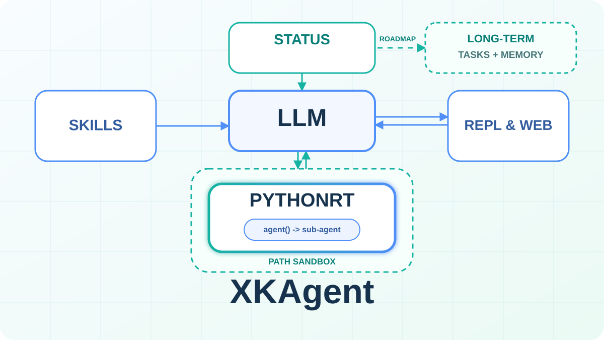
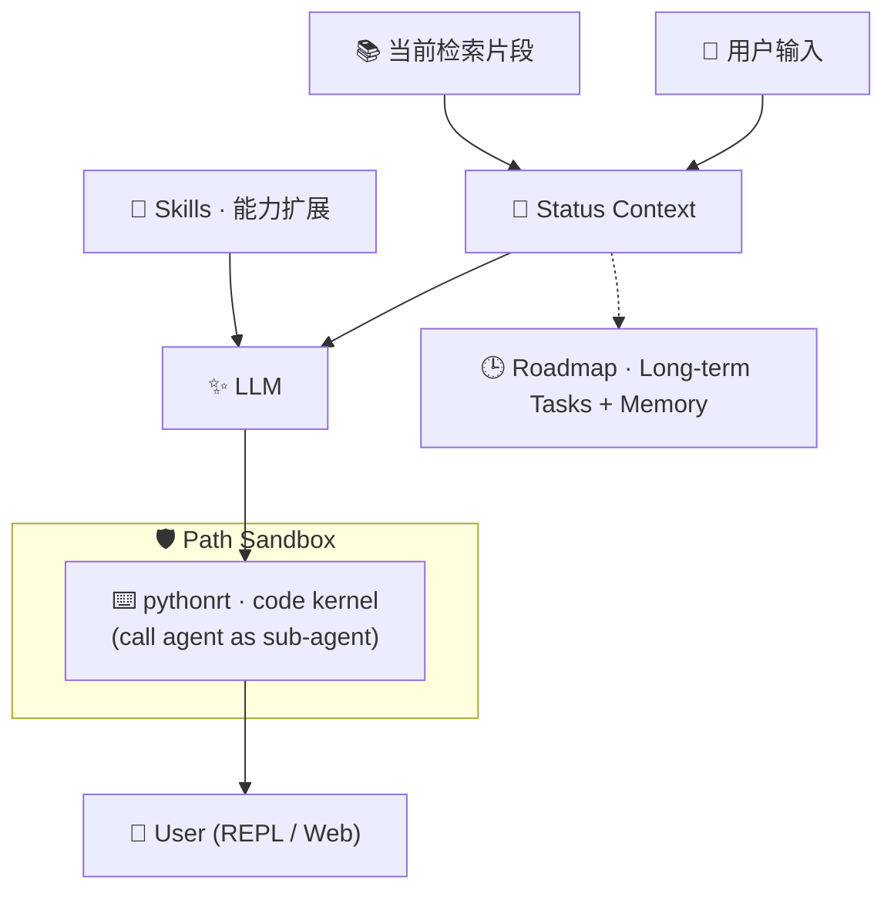
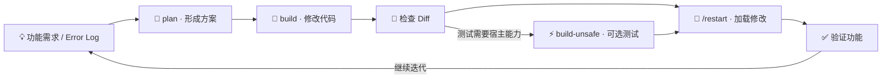

简体中文 | [English](README.en.md)

<p align="center">
  
</p>

<h1 align="center">XKAgent · eXtensible Kernel Agent</h1>

<p align="center">
  <strong>A pure-Python, skill-extensible, status-aware agent runtime prioritizing code over tools.</strong>
</p>

<p align="center">
  
  
  
  
</p>

<p align="center">
  <a href="#quick-start">快速开始</a> ·
  <a href="#customize-xkagent">定制 XKAgent</a> ·
  <a href="#docs">文档地图</a>
</p>

---

XKAgent 是一个在本地运行、可持续扩展的轻量 Agent Runtime。它不为每项能力堆叠专用 Tool，而是让模型通过 `pythonrt` 组合 Python 代码完成任务，并借助 Skills 和 Status 扩展能力与上下文。

## ✨ 为什么是 XKAgent

XKAgent 希望把 Agent 做成一个**容易理解、可以修改、能够持续扩展的内核**。它不靠不断增加专用工具来堆叠能力，而是提供清晰的执行、扩展和状态接口。

### 🐍 Pure Python · 轻量、透明、可自举

核心代码全部使用 Python，REPL + LLM 调用只需 `requests`，`pythonrt` 沙箱本体基于标准库；Web、语义搜索和沙箱内 Git 均为可选能力。较小的依赖面让运行逻辑更容易阅读、调试和替换，也让 XKAgent 能够参与修改自身。

### ⌨️ pythonrt · Code over Tools, Agent as a Function

与其为读取文件、转换数据或调用库分别定义大量 Tool，XKAgent 让模型通过 `pythonrt` 编写并组合 Python 代码。代码本身就是通用工具：一个执行原语可以完成多步操作、复用现有库并验证结果，减少工具数量和往返调用。

`pythonrt` 还可以在任务链内部调用 `agent`，把需要独立语义理解的步骤作为函数委派给子 Agent；获得结构化结果后，主流程继续执行。子 Agent 因而不是另一套并列的工具体系，而是 code-first 执行内核中可组合、可嵌套的能力。

### 🧩 Skills · 在内核之外扩展能力

Skill 把领域知识、工作流程、参考资料和脚本组织在独立目录中。新增或覆盖 Skill 不需要修改 Agent 主循环，并且可以在运行期间热加载。核心保持小而稳定，具体能力按任务持续生长。

### 🧭 Status · 长程任务与 Memory 的状态底座

Agent 不应只看到用户最后一句话。XKAgent 在每轮请求中注入时间、运行模式、路径权限、建议技能和检索信息，让模型知道“当前处于什么状态、可以做什么、有哪些与当前任务相关的长期记忆、项目文档或外部知识”。Status 注入已经实现；完整的长程任务编排和长期 Memory 尚未实现，它们将建立在这层稳定的状态接口之上。

### 🛡️ Sandbox · 渐进信任，而不是绝对安全

XKAgent 通过三档模式逐步开放执行权限：

| 模式 | 用途 | 权限 |
|---|---|---|
| 🔎 `plan` | 阅读代码、分析需求、生成方案 | 项目路径只读，`/tmp` 可写 |
| 🔧 `build` | 修改代码和文档 | 仅授权路径可写，仍受轻量沙箱限制 |
| ⚡ `build-unsafe` | 运行测试或需要完整 Python 的任务 | 接近宿主 Python，仅保留少量保护 |

路径沙箱用于降低 LLM 误操作风险，不用于对抗恶意代码或高危险场景。一般修改需要复原时，可以让 Agent 参考当前会话中的修改历史、备份文件和 diff 执行反向修改；这不是底层事务式自动回滚。重要资料仍应由用户使用 Git、快照或其他方式自主备份。

---

## ⚙️ 它如何工作



每轮交互并非“模型逐个点击工具”，而是沿着“用户交互 → 上下文注入 → 模型规划 → Python 组合执行 → 返回用户”的路径完成。虚线 `Roadmap` 仅表示 Status 未来可以支撑长程任务与长期 Memory，并不代表这两项能力已经实现。更多细节请参阅 [架构总览](.xkagent/docs/codes_功能整理.md)。

---

<a id="quick-start"></a>

## 🚀 快速开始

### ① 下载

```bash
git clone <your-repository-url> xkagent
cd xkagent
```

也可以直接下载源码，然后进入项目目录。

### ② 安装

如只需使用 REPL，安装最小依赖即可：

```bash
python -m pip install requests
```

如需使用 Web、语义搜索和内置 Git 等可选能力，请安装完整依赖：

```bash
python -m pip install -r requirements.txt
```

### ③ 配置 Provider 和 Model

先复制配置模板：

```bash
cp provider.config.example .xkagent/provider.config
```

再编辑 `.xkagent/provider.config`：

```ini
[default]
provider: my-provider

[my-provider]
type: openai
api_key_env: OPENAI_API_KEY
base_url: https://api.openai.com/v1
default_model: gpt-4o
```

随后设置对应的环境变量，也可以直接在配置中填写 `api_key`。配置支持 OpenAI-compatible 和 Anthropic 两类 API，保存后会自动热加载。

> 🔗 **Provider：** [OpenCode](https://opencode.ai/go?ref=EZJKXQFZC8) · [DeepSeek](https://platform.deepseek.com/usage) · [方舟 Coding Plan](https://volcengine.com/L/dnCvcytBlL8/)

详见 [Provider 与运行配置](.xkagent/docs/02-配置管理.md) 和 [配置模板](provider.config.example)。

### ④ 启动

#### 使用 `run.sh`

```bash
./run.sh --workdir <workdir> [--mode web --port <port> --user <username> --password <password>]
```

#### 使用 Python

```bash
python -m codes --workdir <workdir> [--mode web --port <port> --user <username> --password <password>]
```

无论采用哪种方式，启动时都应显式指定 `--workdir`。不传入 `--mode web` 时会进入 REPL；传入后则启动 Web。Web 默认监听 `127.0.0.1:7860`，默认用户名为 `admin`，仅在设置 `--password` 后启用认证。

### ⑤ 设置 Model

启动进入 REPL（或 Web）后，用 `/model` 命令查看或切换模型：

```text
/model                  # 显示当前 provider、模型、reasoning effort 和可用模型
/model <name>           # 切换模型（别名或完整模型名，如 /model gpt-4o）
/model <name>:<effort>  # 切换模型并临时覆盖 reasoning effort（如 /model gpt-5:high）
/model @<provider>      # 切换到指定 provider（如 /model @anthropic）
/model test             # 测试全部已配置模型的联通性
/model test <name>      # 只测试指定模型
```

`/model <name>` 的 `<name>` 可以是配置中 `models.<alias>` 定义的别名（如 `/model flash`）、`<provider>.<alias>` 或 `<provider>.<model>`（如 `/model openai.flash`），也可以是完整模型名（如 `/model gpt-4o`），输入模型名时会自动切换到所属 provider。`/model test` 只做联通性探测，不会切换当前模型。

---

<a id="customize-xkagent"></a>

## 🛠️ 定制你自己的 XKAgent

XKAgent 可以直接在自身代码库中完成“设计 → 修改 → 加载 → 验证”的定制循环。`build-unsafe` 仅用于常规沙箱无法完成测试的情况，并非必经阶段。



1. **Describe** · 提供功能需求或错误日志，说明希望调整的行为。
2. **Plan** · 在 `plan` 模式下让 Agent 阅读代码、确认边界并形成方案。
3. **Build** · 切换到 `build` 模式，按照方案修改代码，并检查 diff。
4. **Test when needed** · 只有受限沙箱无法完成测试时，才切换到 `build-unsafe` 模式。
5. **Reload & Verify** · 执行 `/restart` 加载修改，确认结果是否符合预期。

建议在每一步完成后检查 diff，并在进入 `build-unsafe` 前提交或备份工作区。

---

<a id="docs"></a>

## 🧭 文档地图

| 开始使用 | 核心机制 | 扩展与界面 |
|---|---|---|
| [🚀 安装与启动](.xkagent/docs/01-入口与启动.md) | [✨ LLM 调用](.xkagent/docs/04-LLM调用层.md) | [🧩 Skill 扩展](.xkagent/docs/07-技能系统.md) |
| [⚙️ Provider 与配置](.xkagent/docs/02-配置管理.md) | [🛡️ pythonrt 与沙箱](.xkagent/docs/05-沙箱与工具执行.md) | [🧠 搜索与记忆](.xkagent/docs/08-搜索与记忆.md) |
| [💾 存储与日志](.xkagent/docs/03-基础设施.md) | [🤖 Agent 引擎](.xkagent/docs/06-Agent引擎.md) | [⌨️ 命令参考](.xkagent/docs/09-命令系统.md) |
| [🏗️ 架构总览](.xkagent/docs/codes_功能整理.md) |  | [💻 REPL 与 Web](.xkagent/docs/10-前端界面.md) |

### 💬 不想阅读文档？直接问 XKAgent

启动后，可以让 Agent 先阅读项目文档和源码，再结合两者回答问题。以下示例假设 `--workdir` 已指向 XKAgent 仓库根目录：

```text
请先阅读 .xkagent/docs/ 和 codes/，结合文档与实际源码回答我：
<你想了解的问题>
```

例如：

```text
请先阅读 .xkagent/docs/ 和 codes/，结合文档与实际源码回答我：
pythonrt、Skills 和 Status 分别解决什么问题，它们之间如何协作？
```

这样即使没有预先通读全部文档，也可以从具体问题入手了解 XKAgent。涉及实现细节时，请以当前源码为准。

---

## ⚠️ 安全说明

- `plan` / `build` 沙箱是用于降低误操作风险的软边界，并非安全容器。
- `build-unsafe` 可以执行接近完整的宿主 Python，仅应在代码可信且目录已备份时使用。
- 对于一般修改，可以让 Agent 参考修改历史、备份和 diff 进行复原。
- `/cmds` 只记录命令操作，不能替代逐文件版本历史或事务式回滚。
- 请勿将 API Key 提交到仓库；`.xkagent/provider.config` 已被 `.gitignore` 排除。
- 重要资料仍须由用户通过 Git、文件快照或独立备份进行保护。

> ⚠️ **重要：** XKAgent 的沙箱用于降低 LLM 误操作风险，并非对抗恶意代码的安全容器。进入 `build-unsafe` 前，请提交 Git 或创建备份。

---

## 📄 License

XKAgent 使用 [MIT License](LICENSE)。
