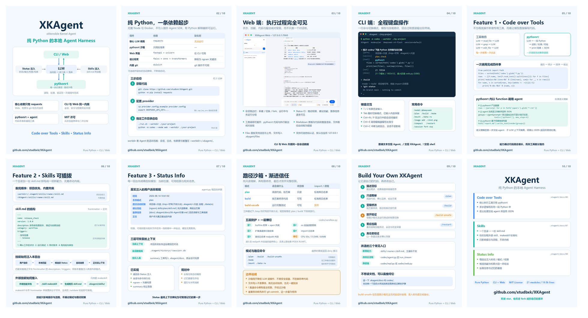
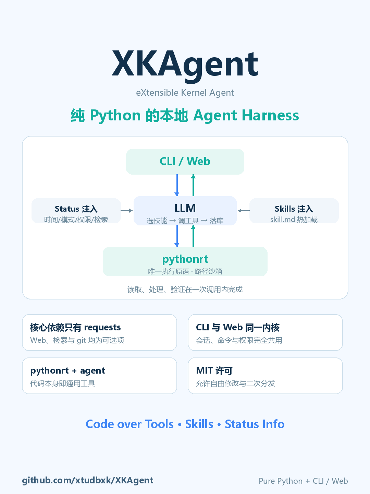
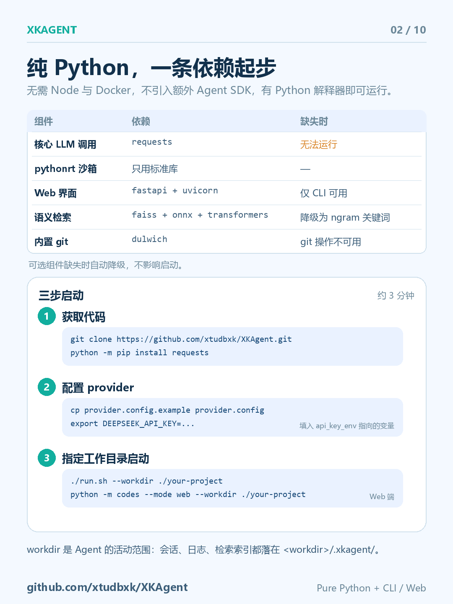
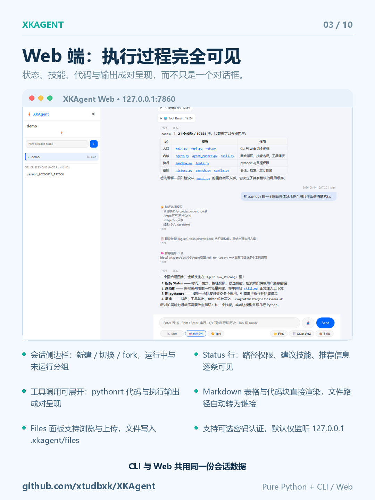
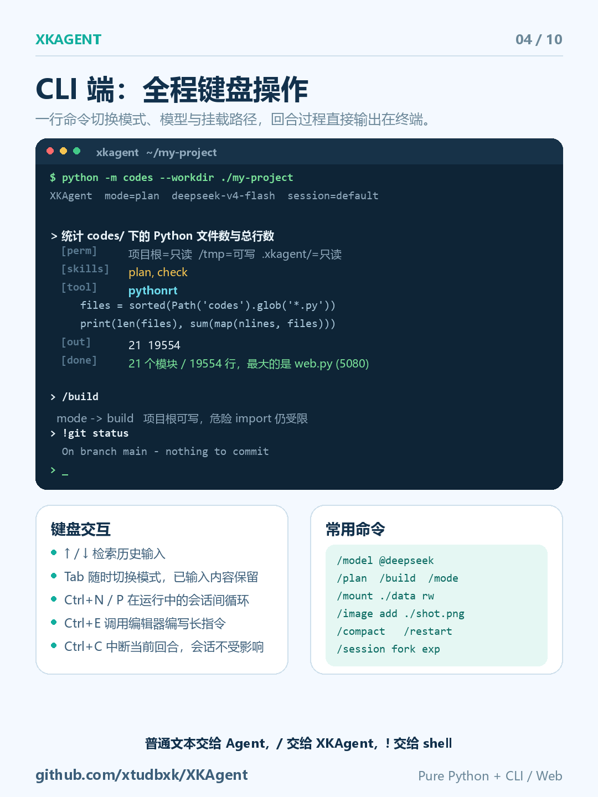
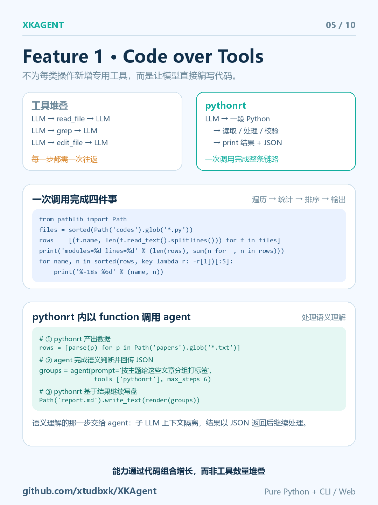
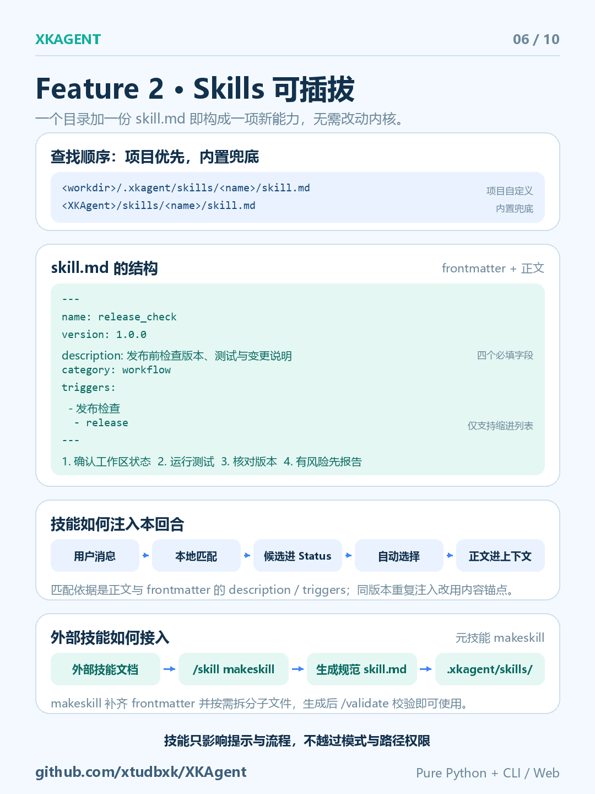
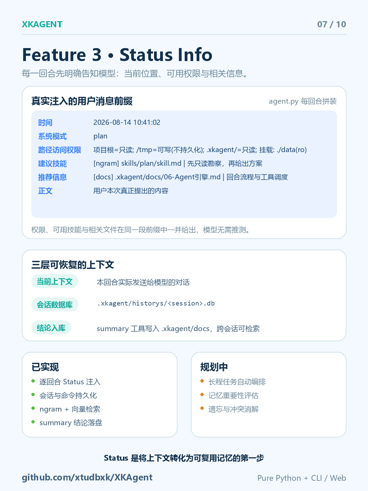
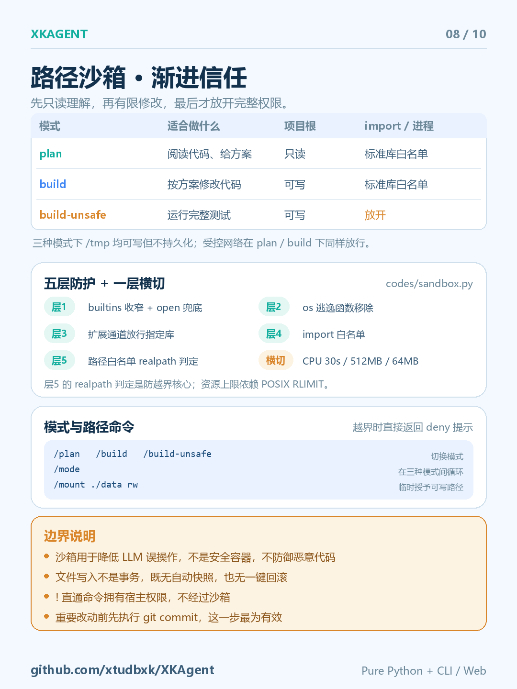
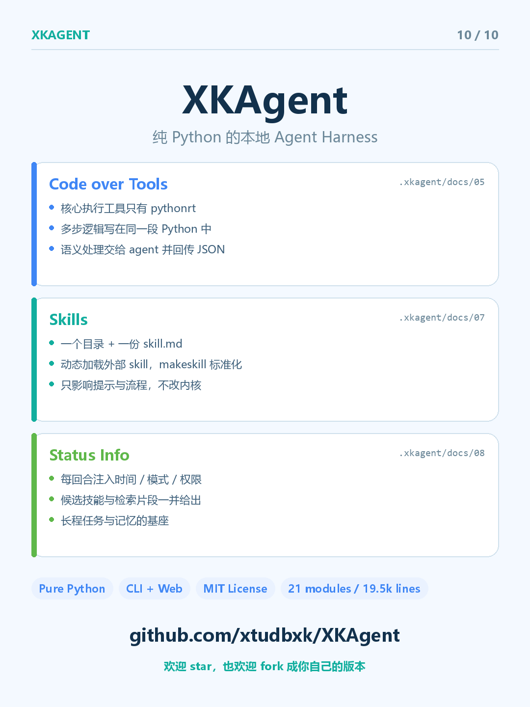

# XKAgent 图文介绍 📕

**XKAgent · eXtensible Kernel Agent** —— 纯 Python 的本地 Agent Harness

> Code over Tools · Skills 可插拔 · Status Info · 核心依赖只有 requests · CLI 与 Web 同一内核 · MIT 许可

> GitHub: <https://github.com/xtudbxk/XKAgent>

## 🔗 小红书原文

[📕 点击查看小红书原帖](https://www.xiaohongshu.com/explore/6a7ec001000000002c00599d?xsec_token=YBnWhA8rCHggjdoAAOzKJbv9Ue5q05GZo30h0weLSZ4io%3D&xsec_source=pc_creatormng)

---

## 📸 图文速览

### 封面

### 1. 项目简介与架构

### 2. 纯 Python，一条依赖起步

### 3. Web 端：执行过程完全可见

### 4. CLI 端：全程键盘操作

### 5. Feature 1 · Code over Tools

### 6. Feature 2 · Skills 可插拔

### 7. Feature 3 · Status Info

### 8. 路径沙箱 · 渐进信任

### 9. Build Your Own XKAgent

### 10. 总结 · 欢迎 star & fork

---

## 🚀 快速跳转

- [📕 小红书原帖](https://www.xiaohongshu.com/explore/6a7ec001000000002c00599d?xsec_token=YBnWhA8rCHggjdoAAOzKJbv9Ue5q05GZo30h0weLSZ4io%3D&xsec_source=pc_creatormng)
- [返回 README](README.md)

*XKAgent 欢迎 star，也欢迎 fork 成你自己的版本 ⭐*